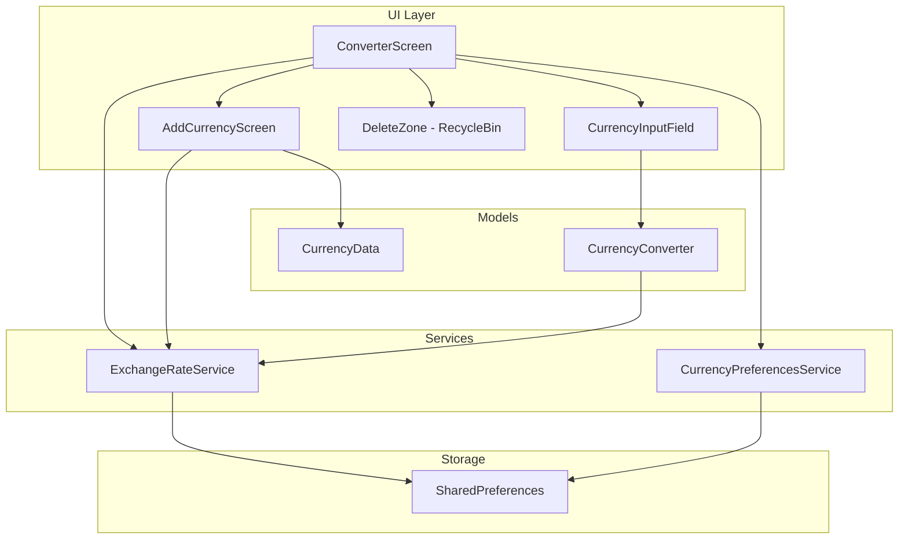
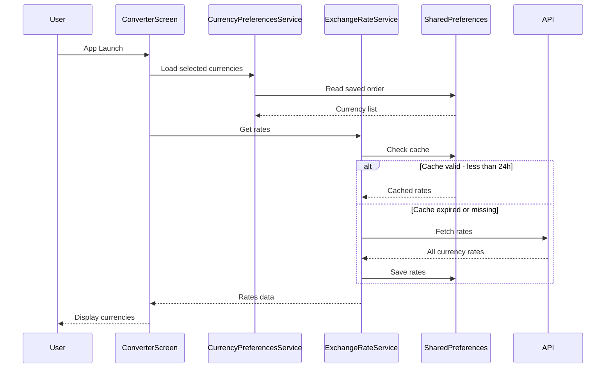
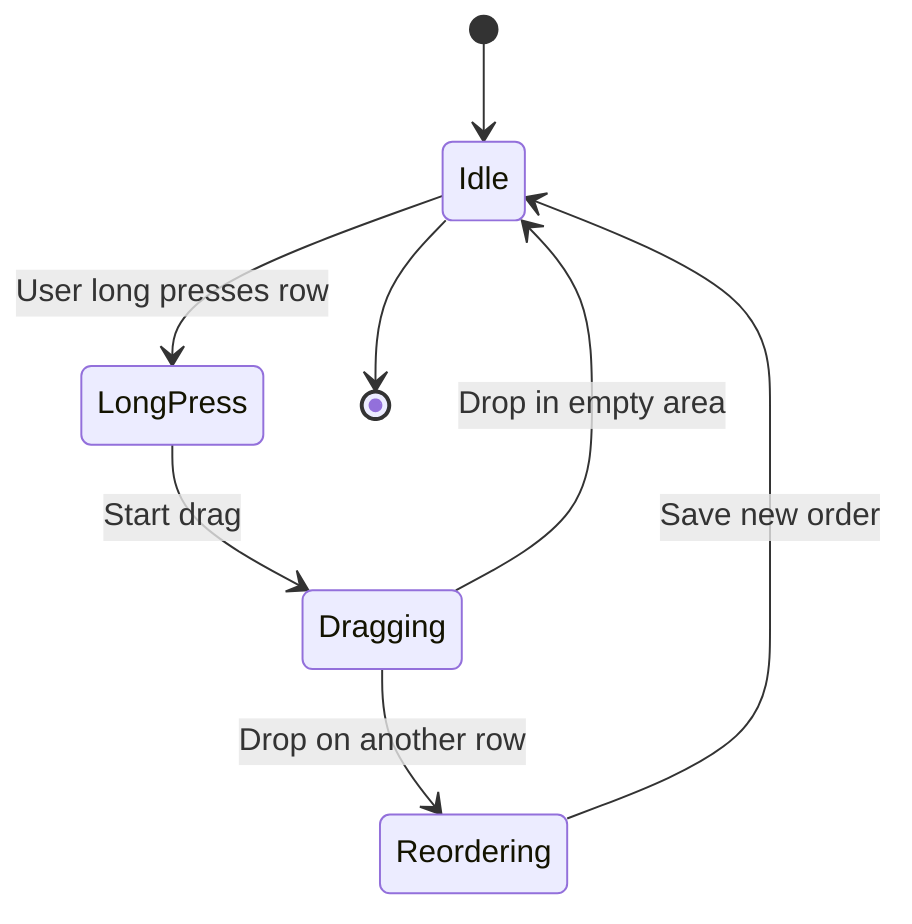
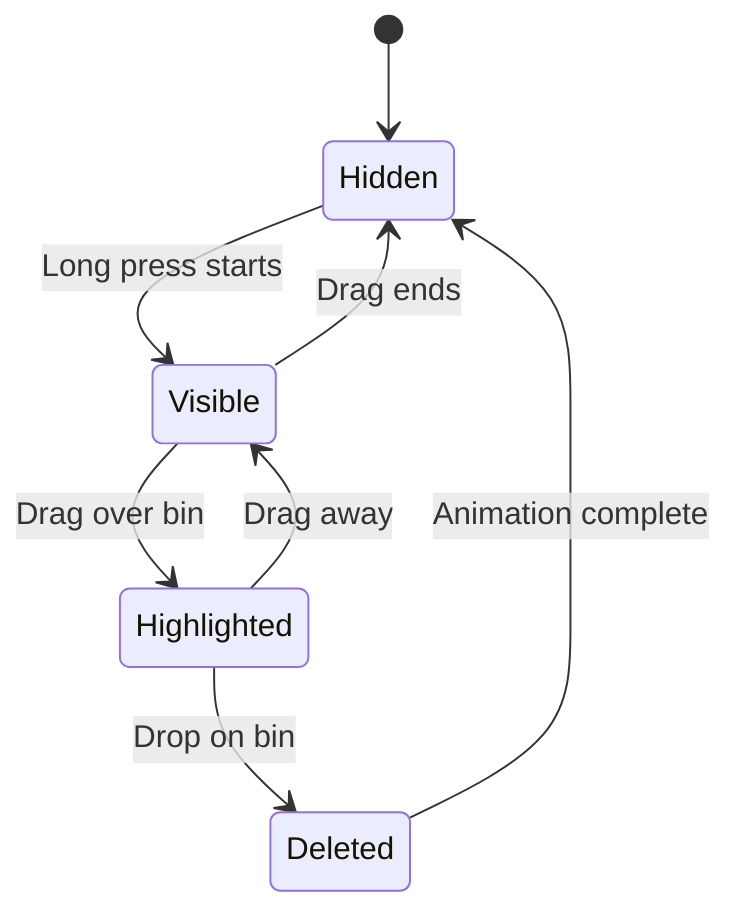

# Multi-Currency Converter Enhancement Plan

## Overview

This plan outlines the implementation of drag-to-reorder, delete functionality, and multi-currency support for the Currency Exchange app.

## Architecture Diagram



## Data Flow Diagram



## New Files to Create

### 1. `lib/models/currency_data.dart`
Complete currency database with:
- Currency code (USD, JPY, EUR, etc.)
- Country name
- Currency name
- Flag emoji (derived from country code)
- Decimal places

### 2. `lib/services/currency_preferences_service.dart`
Manages user preferences:
- Selected currencies list
- Currency display order
- Save/load from SharedPreferences

### 3. `lib/screens/add_currency_screen.dart`
New screen for adding currencies:
- Search bar at top
- Scrollable list of all currencies
- Flag, country name, currency code display
- Filter by country name or currency code
- Tap to add and return to main screen

## Files to Modify

### 1. `lib/services/exchange_rate_service.dart`
Changes:
- Add comprehensive fallback rates for ~160 currencies
- Add method to fetch rate for specific currency
- Initialize with default rates on first install

### 2. `lib/models/currency_converter.dart`
Changes:
- Update to work with any currency code
- Dynamic decimal places based on currency

### 3. `lib/widgets/currency_input_field.dart`
Changes:
- Wrap with LongPressDraggable
- Add drag feedback UI
- Support drag data for reordering

### 4. `lib/screens/converter_screen.dart`
Major refactoring:
- Dynamic currency list from preferences
- ReorderableListView for drag reorder
- DragTarget delete zone (red recycle bin)
- Add Currency button
- Dynamic controllers/focus nodes management

## Feature Details

### 1. Drag to Reorder



**Implementation:**
- Use ReorderableListView.builder for native reorder support
- Long press initiates drag
- Visual feedback during drag (slight elevation, opacity)
- Save order to preferences on drop

### 2. Delete Currency (Recycle Bin)



**Implementation:**
- Red recycle bin appears at bottom when dragging starts
- DragTarget accepts currency drops
- Confirm deletion with visual feedback
- Remove from list and save preferences
- Minimum 1 currency must remain

### 3. Add Currency Screen

**UI Layout:**
```
┌────────────────────────────────┐
│  ← Add Currency                │
├────────────────────────────────┤
│  🔍 Search country or currency │
├────────────────────────────────┤
│  🇦🇺 Australia          AUD   │
│  🇦🇹 Austria            EUR   │
│  🇧🇷 Brazil             BRL   │
│  🇨🇦 Canada             CAD   │
│  🇨🇭 Switzerland        CHF   │
│  ...                           │
└────────────────────────────────┘
```

**Features:**
- Search filters both country name and currency code
- Already-added currencies shown with checkmark (disabled)
- Tap to add → fetch rate → return to main screen
- Sorted alphabetically by country name

### 4. Default Rates on First Install

**Fallback rates include (sample):**
```dart
static const Map<String, double> _defaultRates = {
  'USD': 1.0,
  'EUR': 0.92,
  'GBP': 0.79,
  'JPY': 149.50,
  'AUD': 1.53,
  'CAD': 1.36,
  'CHF': 0.88,
  'CNY': 7.24,
  'HKD': 7.82,
  'SGD': 1.34,
  'INR': 83.12,
  'KRW': 1298.50,
  'MXN': 17.15,
  'BRL': 4.97,
  'ZAR': 18.65,
  // ... 150+ more currencies
};
```

**Logic:**
1. On first launch, save default rates to SharedPreferences immediately
2. Set timestamp to 0 (expired) so API fetch is triggered
3. If API fails, default rates are already available
4. User can convert currencies even without internet

## Implementation Order

1. **Phase 1: Data Foundation**
   - Create CurrencyData model with all world currencies
   - Update ExchangeRateService with default rates
   - Create CurrencyPreferencesService

2. **Phase 2: Add Currency Feature**
   - Create AddCurrencyScreen
   - Integrate with ConverterScreen
   - Test adding new currencies

3. **Phase 3: Drag and Delete**
   - Modify CurrencyInputField for dragging
   - Update ConverterScreen with reorder and delete
   - Add recycle bin UI

4. **Phase 4: Testing**
   - Test offline first-install scenario
   - Test drag reorder
   - Test delete functionality
   - Test add currency and rate fetch
   - Build APK

## Questions for Clarification

1. **Minimum currencies:** Should there be a minimum number of currencies that must remain (e.g., at least 1)?
   - *Proposed: Yes, at least 1 currency must remain*

2. **Maximum currencies:** Should there be a limit on how many currencies can be added?
   - *Proposed: No limit*

3. **Default currencies on first install:** Keep USD, JPY, SGD, CNY or different defaults?
   - *Proposed: Keep current 4 as defaults*

4. **Delete confirmation:** Should deleting a currency require confirmation dialog?
   - *Proposed: No, instant delete with visual feedback*

5. **Duplicate prevention:** Already added currencies should be non-selectable in add screen?
   - *Proposed: Yes, show as disabled/grayed out with checkmark*

---

**Ready for your review.** Please let me know if you'd like any changes to this plan before I proceed with implementation.